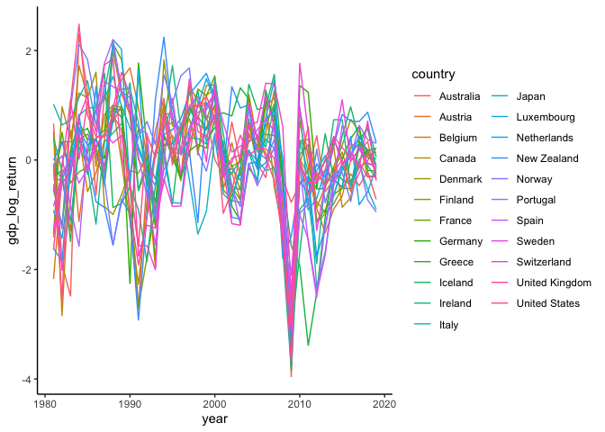

<!-- README.md is generated from README.Rmd. Please edit that file -->

# eclust

<!-- badges: start -->

<!-- badges: end -->

The goal of eclust is to implement the clustering algorithm from [Davis,
R.A., Fernandes, L. and Fokianos, K.
(2023)](https://onlinelibrary.wiley.com/doi/10.1111/jtsa.12688).

## Installation

You can install the development version of eclust like so:

``` r
#install.packages("pak")
pak::pkg_install("leonfernandes/eclust")
```

## Demonstration for `gdp`

We demonstrate the clustering method for the `gdp` dataset provided with
this package, sourced from <https://www.conference-board.org/us/>.

``` r
library(eclust)
library(tsibble)
#> 
#> Attaching package: 'tsibble'
#> The following objects are masked from 'package:base':
#> 
#>     intersect, setdiff, union
library(ggplot2)
dplyr::glimpse(gdp)
#> Rows: 920
#> Columns: 3
#> Key: country [23]
#> $ country <chr> "Australia", "Australia", "Australia", "Australia", "Australia…
#> $ year    <dbl> 1980, 1981, 1982, 1983, 1984, 1985, 1986, 1987, 1988, 1989, 19…
#> $ gdp     <dbl> 431329, 449122, 450019, 447042, 477014, 501031, 511606, 537039…
```

We preprocess the data to obtain the log returns of the gdp.

``` r
gdp_log_return <-
  gdp |>
  dplyr::group_by(country) |>
  dplyr::mutate(gdp = log(gdp) - dplyr::lag(log(gdp))) |>
  tidyr::drop_na() |>
  dplyr::mutate(gdp = as.numeric(scale(gdp))) |>
  dplyr::rename(gdp_log_return = gdp) |>
  dplyr::ungroup()

ggplot(gdp_log_return) +
  aes(year, gdp_log_return, color = country) +
  geom_line() +
  theme_classic()
```



Calculate the energy distance based dissimilarity matrix.

``` r
dist_mat <- edist(gdp_log_return, lag = 1)
```

Perform hierarchical clustering and display the obtained dendrogram.

``` r
hc <- stats::hclust(dist_mat, method = "ward.D2")
plot(hc)
```


