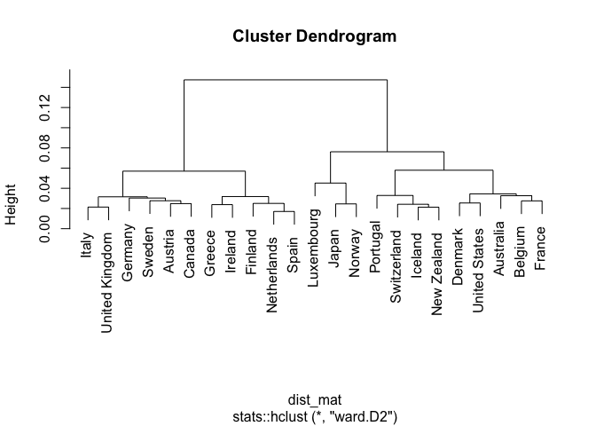

<!-- README.md is generated from README.Rmd. Please edit that file -->

# eclust

<!-- badges: start -->

<!-- badges: end -->

The goal of eclust is to implement the clustering algorithm from [Davis,
R.A., Fernandes, L. and Fokianos, K.
(2023)](https://onlinelibrary.wiley.com/doi/10.1111/jtsa.12688).

## Installation

You can install the development version of eclust like so:

``` r
#install.packages("pak")
pak::pkg_install("leonfernandes/eclust")
```

## Demonstration for `gdp`

We demonstrate the clustering method for the `gdp` dataset provided with
this package, sourced from <https://www.conference-board.org/us/>.

``` r
library(eclust)
library(tsibble)
#> 
#> Attaching package: 'tsibble'
#> The following objects are masked from 'package:base':
#> 
#>     intersect, setdiff, union
gdp
#> # A tsibble: 920 x 3 [1Y]
#> # Key:       country [23]
#>    country    year    gdp
#>    <chr>     <dbl>  <dbl>
#>  1 Australia  1980 431329
#>  2 Australia  1981 449122
#>  3 Australia  1982 450019
#>  4 Australia  1983 447042
#>  5 Australia  1984 477014
#>  6 Australia  1985 501031
#>  7 Australia  1986 511606
#>  8 Australia  1987 537039
#>  9 Australia  1988 559356
#> 10 Australia  1989 585267
#> # ℹ 910 more rows
```

We preprocess the data to obtain the log returns of the gdp.

``` r
gdp_log_return <-
  gdp |>
  dplyr::group_by(country) |>
  dplyr::mutate(gdp = log(gdp) - dplyr::lag(log(gdp))) |>
  tidyr::drop_na() |>
  dplyr::mutate(gdp = as.numeric(scale(gdp))) |>
  dplyr::rename(gdp_logreturn = gdp) |>
  dplyr::ungroup()
```

Calculate the energy distance based dissimilarity matrix.

``` r
dist_mat <- edist(gdp_log_return, lag = 1)
```

Perform hierarchical clustering and display the obtained dendrogram.

``` r
library(ggplot2)
hc <- stats::hclust(dist_mat, method = "ward.D2")
plot(hc)
```


